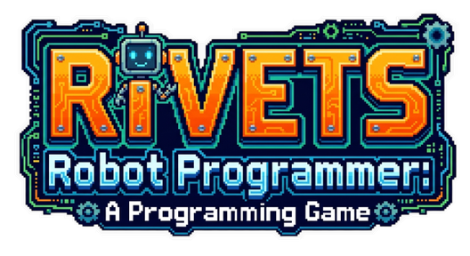

Codebot Maze Serious Game is a Greenfoot-based programming puzzle where you guide a robot through a maze by writing simple instructions. The goal is to reach the objective, collect coins where available, and solve each level with the fewest mistakes possible.

This project was created as part of my Master's assignment for the University of Macedonia, in the Serious Game Development course.

## How To Play

1. Open the game and start from the home screen.
2. Click `START` to play the main campaign, or `FREE PLAY` to load a custom level.
3. Type your program in the code editor using the supported commands: `moveUp`, `moveDown`, `moveLeft`, `moveRight`, and `repeat(n) ... end`.
4. Click `RUN` to execute your program.
5. Use `RESET` if you want to clear the current attempt and try again.
6. Watch the robot move through the maze, avoid obstacles, and reach the goal.

## Repository Layout

- `game/` contains the Greenfoot scenario and Java source code
	- `game/images/` holds the in-game graphics.
	- `game/intro/` and `game/level-intros/` contain intro and level narration assets.
	- `game/sounds/` contains the audio used by the game.
- `lvl-editor/` contains the web-based level editor used to create custom levels.
- `gdd/` contains the game design document files.
- `scripts/` contains dev utility scripts, such as image compression helpers.

## Running In Greenfoot

1. Install Greenfoot if it is not already available on your machine.
2. Open Greenfoot and choose `Open...`.
3. Select the `game/` folder in this repository as the project root.
4. Let Greenfoot load the scenario, then click `Compile`.
5. Click `Run` to launch the scenario. The game opens on the home screen in `HomeWorld`.
6. From there, choose `START` for the campaign or `FREE PLAY` for custom levels.

## Notes

- If Greenfoot prompts for a world, `HomeWorld` is the main entry point.
